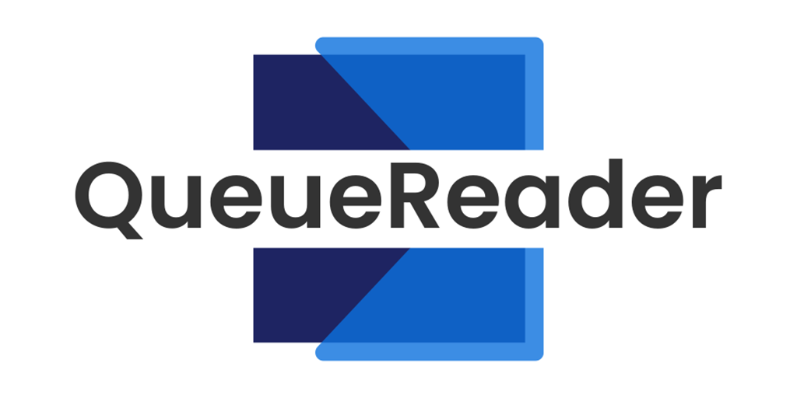
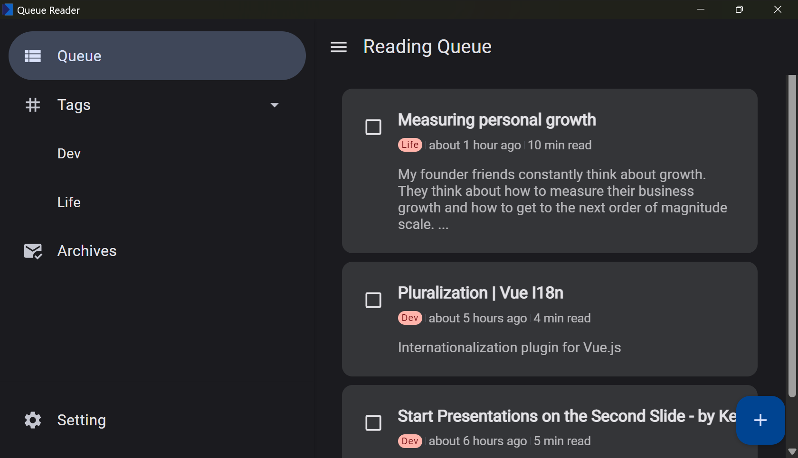
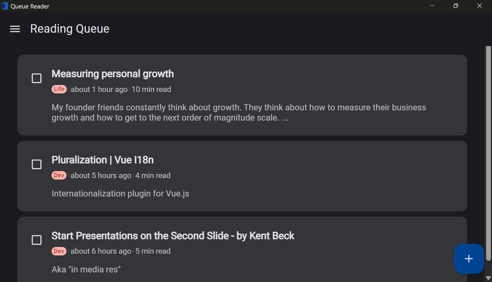

# Queue Reader

Queue Reader is a minimal read-it-later app, built with Material You design.

## Screenshots

## Features

- Minimal & Material You styled UI
- Tagging articles
- Cross platform

## Install(Windows, MacOS, Linux)

You can get the executables in the [release page](https://github.com/BHznJNs/queue-reader/releases)
